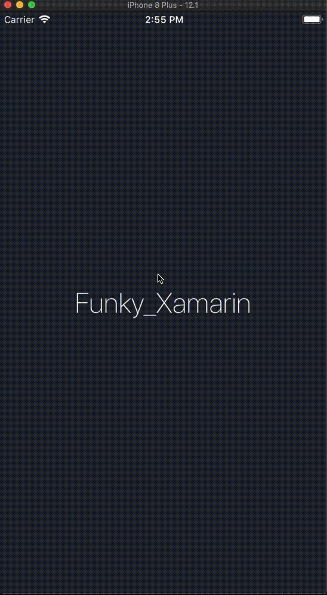

# XHVersion_Xamarin.iOS

[](http://cocoadocs.org/docsets/XHVersion)

## Notify users when a new version of your app is available and prompt them to upgrade.

Port of Xamarin iOS of the [XHVersion](https://github.com/Wenfengcheng/XHVersion)


## NuGet

* [Xamarin.iOS.XHVersion](https://www.nuget.org/packages/Xamarin.iOS.XHVersion) [](https://www.nuget.org/packages/Xamarin.iOS.XHVersion)

### Overview



### Usage
To alert new version with default style:
```
XHVersion.XHVersion.CheckNewVersion();
```

To alert new version with custom ui:
```
XHVersion.XHVersion.checkNewVersionAndCustomAlert((info)=>{

});
```

### Reference

- [XHVersion](https://github.com/CoderZhuXH/XHVersion)
- [一句话实现iOS版本更新提示](https://github.com/RockChanel/SELUpdateAlert)
